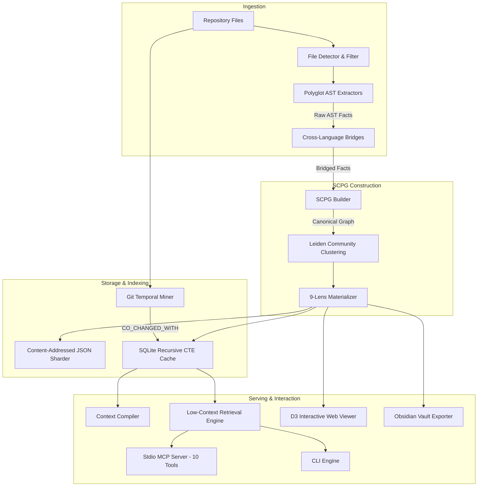

# 02 - System Architecture & Pipeline

## 1. Architectural Overview

RepoPeek operates on a multi-stage, deterministic pipeline that transforms a raw source code repository into a Semantic Code Property Graph (SCPG), materializes 9 specialized lenses, indexes the graph into SQLite and JSON shards, and serves intelligence to AI coding agents via stdio MCP and CLI interfaces.

```
+----------------------------------------------------------------------------------------------------+
| REPOPEEK END-TO-END PIPELINE                                                                       |
|                                                                                                    |
| [1. DETECT]          Scans repo, applies ignore rules, classifies files by runtime/type.           |
|         │                                                                                          |
|         ▼                                                                                          |
| [2. EXTRACT]         Polyglot AST parsers (Python, TS/JS, SQL, Shell, Config) emit raw facts.      |
|         │                                                                                          |
|         ▼                                                                                          |
| [3. BRIDGE]          Cross-language resolution: HTTP boundary bridge, SQL def-use, subprocesses.  |
|         │                                                                                          |
|         ▼                                                                                          |
| [4. BUILD]           Builds SCPG in NetworkX; enforces runtime namespaces; normalizes arc vectors.  |
|         │                                                                                          |
|         ▼                                                                                          |
| [5. CLUSTER]         Leiden algorithm partitions SCPG into cohesive architectural communities.     |
|         │                                                                                          |
|         ▼                                                                                          |
| [6. MATERIALIZE]     Derives 9 deterministic lens subgraphs (Module, Call, Data, Config, etc.).    |
|         │                                                                                          |
|         ▼                                                                                          |
| [7. INDEX & CACHE]   Writes atomic JSON shards + populates SQLite recursive CTE index; mines git.  |
|         │                                                                                          |
|         ▼                                                                                          |
| [8. SERVE & ACT]     Stdio MCP server (10 tools) + CLI + D3 interactive viewer + Obsidian export.  |
+----------------------------------------------------------------------------------------------------+
```

---

## 2. Pipeline Stages in Detail

### Stage 1: Detect (`repopeek.detect`)
- **Input:** Target repository root path.
- **Responsibilities:**
  - Recursively discovers source files, honoring `.gitignore`, `.repopeekignore`, and binary file exclusion lists.
  - Classifies files into runtime categories: `python`, `typescript`, `javascript`, `sql`, `shell`, `config_json`, `config_yaml`.
  - Computes file-level SHA-256 hashes and modification timestamps (`st_mtime_ns`, `st_size`).
  - **Threshold Safety Guard:** Evaluates repository scale. Emits warning and provides fast-exit options if codebase exceeds 400 files or projected 8,000 nodes without explicit `--force` flag.

### Stage 2: Extract (`repopeek.extract`)
- **Input:** List of detected file paths and project root.
- **Responsibilities:**
  - Invokes specialized AST parsers based on language classification:
    - *Python:* Python stdlib `ast` parser (classes, functions, async defs, calls, imports, docstrings, exceptions).
    - *TypeScript / JavaScript:* Tree-sitter AST parser (classes, methods, interfaces, types, imports/exports, calls, JSX).
    - *SQL:* SQLGlot AST engine (DDL tables, columns, `SELECT` reads, `INSERT`/`UPDATE`/`DELETE` writes).
    - *Shell:* Bash parser (script commands, script dispatches, env variable references).
    - *Configuration:* YAML and JSON schema parsers (keys, database connection strings, environment flags).
  - Emits normalized atomic facts: `{ "nodes": [...], "edges": [...] }` with exact line and column spans.

### Stage 3: Bridge (`repopeek.bridge`)
- **Input:** Raw extraction facts from all polyglot files.
- **Responsibilities:**
  - Connects isolated language graphs across architectural boundaries:
    - **HTTP Boundary Bridge:** Matches client API calls (TypeScript `fetch`, `axios`) to server route handlers (FastAPI, Flask, Express) using wildcard path parameter normalization (`:param`). Synthesizes `INVOKES` edges.
    - **SQL Data Binding Bridge:** Connects ORM/raw query strings in application code to SQL table schema nodes. Synthesizes `READS` and `WRITES` edges.
    - **Subprocess Bridge:** Connects Python `subprocess.run(["./deploy.sh"])` or `os.system` calls to shell script file nodes. Synthesizes `EXECUTES` edges.
    - **Config Key Bridge:** Connects `os.environ.get("DB_PORT")` and `config.get(...)` calls to YAML/JSON configuration property nodes. Synthesizes `CONFIGURES` edges.

### Stage 4: Build (`repopeek.build`)
- **Input:** Extracted nodes, edges, and bridged relationships.
- **Responsibilities:**
  - Instantiates the canonical NetworkX property graph (`nx.DiGraph`).
  - **Namespace Isolation Enforcement:** Prefixes all identifiers with runtime domain tags (`py:`, `ts:`, `sql:`, `sh:`, `npm:`, `py_builtin:`) to prevent cross-language string collisions.
  - Normalizes edge arc directions and drops unresolvable dangling phantoms, except typed external stubs.
  - Assigns confidence scores: `EXTRACTED` (direct AST evidence), `INFERRED` (resolved via heuristics or bridges), `AMBIGUOUS` (multi-candidate match).

### Stage 5: Cluster (`repopeek.cluster`)
- **Input:** Canonical SCPG.
- **Responsibilities:**
  - Executes Leiden community detection (using `graspologic_native` or `graspologic` modularity optimization; falls back to NetworkX Louvain).
  - Partitions nodes into densely connected architectural subsystems.
  - Computes community cohesion scores and deterministic LLM-free community labels based on top internal symbol degrees.

### Stage 6: Materialize Lenses (`repopeek.lenses`)
- **Input:** Clustered SCPG.
- **Responsibilities:**
  - Projects 9 deterministic, focused subgraphs on demand:
    1. `Module`: Directory and file hierarchy (`CONTAINS`).
    2. `Symbol`: Function, class, variable, and interface definitions.
    3. `Call`: Static and dynamic function/method invocation graphs (`CALLS`).
    4. `Class`: Inheritance, interface implementation, and mixin hierarchy (`INHERITS`, `IMPLEMENTS`).
    5. `Data`: Variable and entity def-use chains (`READS`, `WRITES`).
    6. `Entity`: Database tables, schemas, and persistence models.
    7. `Config`: Environment variables and configuration keys (`CONFIGURES`).
    8. `Process`: Subprocess invocations and shell execution chains (`EXECUTES`).
    9. `Exception`: Raised and handled exception types (`RAISES`, `HANDLES`).

### Stage 7: Index & Cache (`repopeek.storage`)
- **Input:** Canonical SCPG, lenses, and git repository history.
- **Responsibilities:**
  - Persists atomic JSON shards by community and file under `.repopeek/shards/`.
  - Populates SQLite cache database (`.repopeek/cache.db`) containing indexed tables: `nodes`, `edges`, `node_lenses`, `edge_lenses`, `file_blobs`.
  - Runs Git Temporal Miner over commit log (180-day exponential half-life decay) and records `CO_CHANGED_WITH` edges in SQLite.
  - Updates high-speed memory-mapped cache for instant querying.

### Stage 8: Serve & Act (`repopeek.serve` & `cli`)
- **Input:** Indexed SCPG and query requests.
- **Responsibilities:**
  - Exposes 10-tool stdio Model Context Protocol (MCP) server for IDE agents.
  - Provides instant CLI commands: `lookup`, `neighbors`, `impact`, `data_trace`, `context`, `plan`, `routes`, `co_changes`.
  - Serves interactive D3 force-directed web viewer (`--view`) with real-time 9-lens toggles.
  - Exports structured native Obsidian vault with `.obsidian/` configuration.

---

## 3. Global Schema Definitions

### Node Schema

```json
{
  "id": "py:repopeek.parsers.python::PythonParser.parse",
  "label": "PythonParser.parse",
  "name": "parse",
  "entity_type": "method",
  "runtime_ns": "py",
  "source_file": "repopeek/parsers/python.py",
  "source_location": {
    "start_line": 42,
    "start_col": 4,
    "end_line": 95,
    "end_col": 20
  },
  "content_hash": "a8f3b4c1e2d3...",
  "community": 3,
  "community_label": "AST Parsing Substrate",
  "lenses": ["Symbol", "Call", "Class"],
  "attributes": {
    "is_async": false,
    "visibility": "public",
    "params": ["self", "file_path", "source_code"],
    "return_type": "ParseResult",
    "docstring": "Parses a Python source file into deterministic AST fact dictionaries."
  }
}
```

### Edge Schema

```json
{
  "source": "ts:src/api/client.ts::fetchInvoices",
  "target": "py:app/routers/invoices.py::get_invoices",
  "relation": "INVOKES",
  "confidence": "INFERRED",
  "lenses": ["Call", "Process"],
  "weight": 1.0,
  "source_location": {
    "file": "src/api/client.ts",
    "line": 88
  },
  "metadata": {
    "bridge_type": "http_boundary",
    "http_method": "GET",
    "endpoint_pattern": "/api/v1/invoices/:id",
    "matched_rule": "normalized_path_equality"
  }
}
```

---

## 4. Graph Invariants & Direction Semantics

1. **Strict Arc Direction:** Every edge in RepoPeek is directed: `source` -> `target`.
   - `Caller` -> `CALLS` -> `Callee`
   - `Function` -> `WRITES` -> `Table`
   - `Function` -> `READS` -> `ConfigKey`
   - `ClientFunction` -> `INVOKES` -> `RouteHandler`
   - `Subclass` -> `INHERITS` -> `BaseClass`
   - `Function` -> `RAISES` -> `ExceptionType`
2. **Endpoint Integrity:** No dangling edges or phantom endpoints exist. If an endpoint references an external library or stdlib module, it must be explicitly reified as a typed external stub node (`external=True`, `runtime_ns="npm"` or `"py_builtin"`).
3. **Deterministic ID Generation:** Node IDs are canonical, unique, and strictly derived from:
   `<runtime_ns>:<file_path>::<symbol_hierarchy>`
   Examples:
   - `py:services/auth.py::AuthService.validate_token`
   - `ts:frontend/src/auth.ts::useAuth`
   - `sql:migrations/001_init.sql::table.users`
   - `sh:scripts/deploy.sh::run_docker_build`
   - `npm:axios`
   - `py_builtin:dict`

---

## 5. End-to-End Data Flow Architecture


